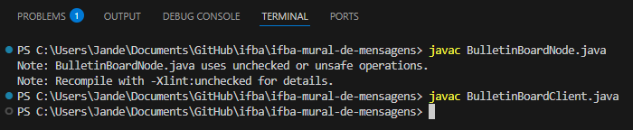
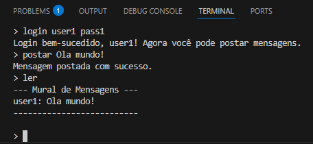

# Trabalho de Mural de Mensagens

- **Instituição:** Instituto Federal da Bahia (IFBA)
- **Curso:** Análise e Desenvolvimento de Sistemas (ADS)
- **Disciplina:** Sistemas Distribuídos
- **Projeto:** Serviço de Mensagens Distribuídas com Consistência Eventual e Autenticação Básica
- **Professor:** Felipe de Souza Silva
- **Semestre:** 5
- **Ano:** 2025.1

## Integrantes do Projeto

<table>
  <tr>
    <td align="center">
      <br />
      <sub><b><a href="https://github.com/JandersonMota">Janderson Mota</a></b></sub>
    </td>
  </tr>
</table>

## Descrição do projeto

Implementar um serviço que permita que usuários enviem mensagens para um mural compartilhado. O sistema deve atender aos seguintes requisitos:
1. Modelo Arquitetural
2. Replicação e Consistência
3. Autenticação Básica
4. Simulação de Falhas

[Lista A8 - Serviço de Mensagens Distribuídas com Consistência Eventual e Autenticação Básica.pdf](https://github.com/user-attachments/files/22119260/A8.-.SAJ-ADS10.-.Servico.de.Mensagens.Distribuidas.com.Consistencia.Eventual.e.Autenticacao.Basica.pdf)

## Ferramentas

- Java

## Simular o sistema

Para simular o sistema, siga estes passos:

1. **Compile o código:** Abra um terminal e digite `javac BulletinBoardNode.java`.
2. **Execute os nós:** Abra três terminais separados. Em cada um, execute o seguinte comando, trocando a porta:
    - **Terminal 1:** `java BulletinBoardNode 65432`
    - **Terminal 2:** `java BulletinBoardNode 65433`
    - **Terminal 3:** `java BulletinBoardNode 65434`

    A ideia é que, quando um nó "falho" for reiniciado, ele execute o método `reconcile` para obter as mensagens perdidas dos outros nós.

3. **Compile o código:** Abra um terminal e digite `javac BulletinBoardClient.java`.
    - **Execute o cliente:** Inicie o cliente e especifique a porta do nó do servidor que você deseja se conectar. Por exemplo, para se conectar ao nó na porta 65432:

      ```
      java BulletinBoardClient 65432
      ```
      
    Você pode executar várias instâncias deste cliente para simular múltiplos usuários interagindo com o sistema.

4. **Comandos:**
    - login <usuario> <senha>
      - **Ex.1:** login user1 pass1
      - **Ex.2:** login user2 pass2
    - postar <mensagem>
      - **Ex.:** postar Oi Servidor!
    - ler
    - exit

## Diagrama da Arquitetura
```
  +---------------------+         +---------------------+         +---------------------+
  |         Nó 1        |  <----> |         Nó 2        |  <----> |         Nó 3        |
  |    (Porta 65432)    |         |    (Porta 65433)    |         |    (Porta 65434)    |
  +---------------------+         +---------------------+         +---------------------+
      ^             ^                 ^             ^                 ^             ^
      |             |                 |             |                 |             |
+-----------+ +-----------+     +-----------+ +-----------+     +-----------+ +-----------+
| Cliente 1 | | Cliente 2 |     | Cliente 3 | | Cliente 4 |     | Cliente 5 | | Cliente 6 |
+-----------+ +-----------+     +-----------+ +-----------+     +-----------+ +-----------+
```

## Estrutura do Projeto
```
ifba-mural-de-mensagens/
├── BulletinBoardClient.java
├── BulletinBoardNode.java
├── Message.java
└── README.md
```

## Documentação

[Documentação Mural de Mensagens.pdf](https://github.com/user-attachments/files/22129217/Documentacao.Mural.de.Mensagens.pdf)

## Evidências de Execução

### Compilar código


### Inicializar Nó


### Inicializar cliente


### Envio de mensagem e demostração de mensagem privada


### Demostração de mensagem pública


### Falha simulada
#### Tentativa de logar


#### Resposta do servidor

